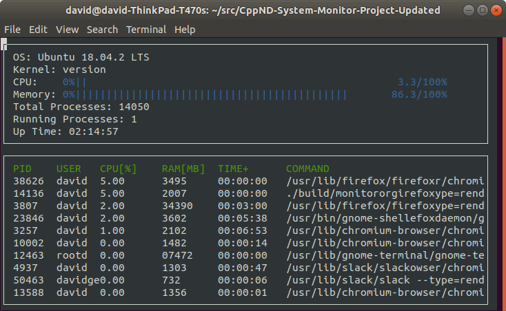

# Linux System Monitor

> **Status: In Progress** — actively being implemented as part of the
> [Udacity C++ Nanodegree](https://www.udacity.com/course/c-plus-plus-nanodegree--nd213)
> Object-Oriented Programming module.

A terminal-based Linux system monitor written in C++, displaying real-time
CPU utilization, memory usage, and per-process statistics using an ncurses UI.

*Target output (once complete):*


---

## Attribution

This project is based on the starter code provided by Udacity for course
**cd0424 — Object-Oriented Programming in C++**. The original starter
repository is available at:
https://github.com/udacity/cd0424-object-oriented-programming-project

Starter code © 2012–2020 Udacity, Inc., licensed under
[CC BY-NC-ND 4.0](http://creativecommons.org/licenses/by-nc-nd/4.0).
All implementation work in this repository is my own.

---

## Project Structure

```
.
├── include/
│   ├── format.h             # Time formatting utilities 
│   ├── linux_parser.h       # Namespace for /proc filesystem parsing
│   ├── ncurses_display.h    # Terminal UI declarations 
│   ├── process.h            # Per-process abstraction
│   ├── processor.h          # CPU abstraction
│   └── system.h             # Top-level system abstraction
├── src/
│   ├── format.cpp           # Time formatting implementation
│   ├── linux_parser.cpp     # /proc parsing implementation
│   ├── main.cpp             # Entry point 
│   ├── ncurses_display.cpp  # Terminal UI implementation
│   ├── process.cpp          # Process attribute accessors
│   ├── processor.cpp        # CPU utilization calculation
│   └── system.cpp           # System-wide data aggregation
├── images/
│   └── monitor.png          # Reference screenshot
├── Makefile
└── README.md
```

---

## Implementation Status

### Core Classes and Namespaces

- [x] **`LinuxParser` namespace** — parses `/proc` and `/etc` filesystem entries
  to provide system-wide data (OS, kernel, uptime, memory utilization, total
  and running process counts, aggregate CPU jiffie counts across all states)
  and per-process data (PID list, command, RAM, UID, username, uptime, and
  per-process active jiffies for CPU utilization calculation)
- [x] **`Format` namespace** — converts elapsed time in seconds to a
  `HH:MM:SS` string (e.g. `30:48:17`) used by the display layer for system
  and per-process uptime
- [x] **`Processor` class** — computes and exposes aggregate CPU utilization
  as a float, using `LinuxParser` CPU data internally
- [x] **`Process` class** — exposes per-process attributes (PID, user, command,
  CPU utilization, RAM, uptime) and implements `operator<` for sorting the
  process list
- [x] **`System` class** — top-level aggregator; owns the `Processor` and
  `Process` list, and exposes OS name, kernel version, memory utilization,
  total process count, running process count, and uptime

`NCursesDisplay` is provided in full and drives the terminal UI — it is not
modified as part of this project.

### Extensions *(planned)*

- [ ] **Dynamic CPU utilization** — compute utilization from a rolling delta
  between two samples rather than a cumulative average from boot
- [x] **CMake modernization** — the starter `CMakeLists.txt` has several issues
  worth addressing: `cmake_minimum_required` is set to 2.6 (circa 2008),
  `file(GLOB ...)` is used for sources (explicitly discouraged by CMake —
  silent build failures when files are added or removed), and there is no
  `CMakePresets.json` for out-of-source builds. Plan: bump minimum to 3.22,
  replace glob with explicit source listing, add `CMakePresets.json`
- [ ] **Abstract base classes** — introduce interfaces via abstract classes and
  pure virtual functions to decouple the display layer from Linux-specific
  implementations, making the design more portable
- [x] **`const` correctness audit** — all getters `const`-qualified, read-only
  parameters passed as `const&`
- [ ] **Unit tests** — GoogleTest coverage for `LinuxParser` parsing functions
- [ ] **GitHub Actions CI** — automated build on push, with `-Werror` enabled
  (fulfilling the existing TODO comment in `CMakeLists.txt`)

---

## Dependencies

| Dependency | Notes |
|---|---|
| GCC / G++ with C++17 support | GCC 7 or later; verify with `g++ --version` |
| CMake | 3.22 or later; verify with `cmake --version` |
| ncurses | Install via `sudo apt install libncurses5-dev libncursesw5-dev` |
| Make | Standard on most Linux distributions |
| Linux kernel (any version) | Required — this project reads from `/proc` directly |

---

## Build & Run

> ⚠️ This project targets **Linux only**. It reads directly from the `/proc`
> virtual filesystem and will not build or run on macOS or Windows.

```bash
# Build
make build

# Build (CMake via CMakePresets.json)
cmake --preset default
cmake --build --preset default

# Run
./build/src/monitor

# Run tests
ctest --preset default

# Debug build (includes debug symbols)
make debug

# Apply clang-format
make format

# Clean build artifacts
make clean
```

---

## What I Implemented

*This section will be filled in as each component is completed, describing
design decisions, any non-obvious implementation details, and notes on
C++ features used.*

---

## License

My implementation code in this repository is released under the
[MIT License](https://opensource.org/licenses/MIT).

The underlying starter code remains subject to the original
[Udacity license](https://github.com/udacity/cd0424-object-oriented-programming-project/blob/main/LICENSE.txt) (CC BY-NC-ND 4.0).
